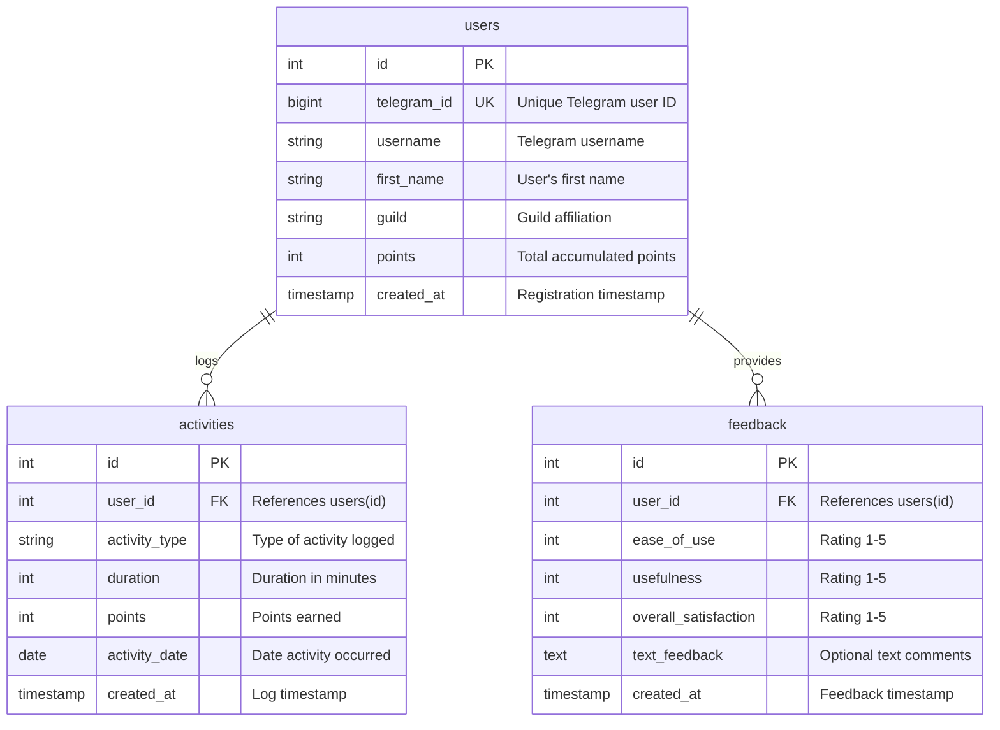

# Database Schema

PostgreSQL schema for the Activity Challenge Bot.

## Schema Overview

Three main tables with simple relationships:



## Tables

### users

```sql
CREATE TABLE users (
  id SERIAL PRIMARY KEY,
  telegram_id VARCHAR(50) UNIQUE NOT NULL,
  username VARCHAR(100),
  first_name VARCHAR(100),
  last_name VARCHAR(100),
  guild VARCHAR(100),
  points DECIMAL(10,2) DEFAULT 0 NOT NULL,
  created_at TIMESTAMP DEFAULT NOW() NOT NULL
);

CREATE INDEX idx_users_telegram_id ON users(telegram_id);
CREATE INDEX idx_users_guild ON users(guild) WHERE guild IS NOT NULL;
CREATE INDEX idx_users_points ON users(points DESC);
```

**Key Fields:**
- `telegram_id`: VARCHAR(50) handles large Telegram IDs safely
- `guild`: No foreign key - validated in application layer (see [Guild Management](/admin/guild-management.md))
- `points`: DECIMAL(10,2) for precision (no float errors)

### activities

```sql
CREATE TABLE activities (
  id SERIAL PRIMARY KEY,
  user_id INTEGER REFERENCES users(id) ON DELETE CASCADE NOT NULL,
  activity_type VARCHAR(255) NOT NULL,
  duration INTEGER,
  points DECIMAL(10,2) NOT NULL,
  description TEXT,
  activity_date DATE DEFAULT CURRENT_DATE,
  created_at TIMESTAMP DEFAULT NOW() NOT NULL
);

CREATE INDEX idx_activities_user_id ON activities(user_id);
CREATE INDEX idx_activities_date ON activities(activity_date);
CREATE INDEX idx_activities_user_date ON activities(user_id, activity_date);

-- Prevent duplicate submissions
CREATE UNIQUE INDEX idx_unique_activity ON activities(
  user_id, activity_type, activity_date, duration, points
);
```

**Key Fields:**
- `activity_type`: Full hierarchy path string (e.g., "Sports > Basketball > Playing basketball, game > competitive")
  - See [Activity Hierarchy](/reference/activity-hierarchy.md) for structure details
- `activity_date`: When performed (separate from `created_at` for retroactive logging)
- `points`: Calculated using MET formula (see [Point System](/reference/point-system.md))
- `CASCADE DELETE`: Remove activities when user deleted

### feedback

```sql
CREATE TABLE feedback (
  id SERIAL PRIMARY KEY,
  user_id INTEGER REFERENCES users(id) ON DELETE CASCADE NOT NULL,
  ease_of_use INTEGER CHECK (ease_of_use >= 1 AND ease_of_use <= 5),
  usefulness INTEGER CHECK (usefulness >= 1 AND usefulness <= 5),
  overall_satisfaction INTEGER CHECK (overall_satisfaction >= 1 AND overall_satisfaction <= 5),
  text_feedback TEXT NOT NULL,
  created_at TIMESTAMP DEFAULT CURRENT_TIMESTAMP,
  reviewed BOOLEAN DEFAULT FALSE
);

CREATE INDEX idx_feedback_user_id ON feedback(user_id);
CREATE INDEX idx_feedback_reviewed ON feedback(reviewed);
```

## Design Decisions

### 1. Denormalized Points

Points stored in both places:
- `users.points`: Aggregate total (fast rankings)
- `activities.points`: Individual values (detailed history)

**Why?** Fast rankings without JOINs, plus ability to verify consistency.

### 2. String-Based Activity Types

Instead of foreign keys: `"Sports > Basketball > Playing basketball, game > competitive"`

**Why?**
- No migrations when activity hierarchy changes
- Easy to search: `WHERE activity_type LIKE '%Basketball%'`
- Human-readable in queries

**Trade-off:** Can't enforce referential integrity at DB level, but hierarchy is validated in application code.

See [Activity Hierarchy](/reference/activity-hierarchy.md) for complete structure.

### 3. No Guild Foreign Key

Guild names validated in application, not database.

**Why?** Add/remove guilds without migrations. Guild list is in code (version controlled, type-safe).

See [Guild Management](/admin/guild-management.md) for configuration.

### 4. Separate Date Fields

- `activity_date`: When activity happened
- `created_at`: When logged

**Why?** Supports retroactive logging ("forgot to log yesterday's run").

## Performance

### Index Strategy

Indexes for common patterns:
- Primary lookups: `telegram_id`, `user_id`
- Sorting: `points DESC`, `created_at DESC`, `activity_date`
- Filtering: `guild` (partial index for non-null)
- Composite: `(user_id, activity_date)` for history queries

### Query Optimization

**Use window functions** for rankings:
```sql
-- Fast
RANK() OVER (ORDER BY points DESC)

-- Slow
(SELECT COUNT(*) FROM users u2 WHERE u2.points > u1.points) + 1
```

**Use LIMIT** for leaderboards:
```sql
SELECT * FROM users ORDER BY points DESC LIMIT 20;
```

See [Local Development](/guide/local-development.md) for performance optimization tips.

## Migrations

**Location:** `src/db/schema.sql`

**Run migrations:**
```bash
bun src/db/migrate.ts
```

The bot runs migrations automatically on startup. Schema uses `CREATE IF NOT EXISTS` for idempotency.

## Backup

See [Database Operations](/admin/database-operations.md) for comprehensive backup and restore procedures:
- Automated daily backups
- Backup retention policies
- Testing restore procedures
- Point-in-time recovery

**Quick backup:**
```bash
pg_dump -U postgres activity_challenge_bot > backup.sql
```

## Data Integrity

### Verify Points Consistency

```sql
SELECT u.id, u.points as stored, COALESCE(SUM(a.points), 0) as calculated,
       u.points - COALESCE(SUM(a.points), 0) as difference
FROM users u
LEFT JOIN activities a ON u.id = a.user_id
GROUP BY u.id, u.points
HAVING ABS(u.points - COALESCE(SUM(a.points), 0)) > 0.01;
```

## Further Reading

- [Database Operations](/admin/database-operations.md) - Backup, maintenance, and operations
- [Competition Setup](/admin/competition-setup.md) - Configure competition periods
- [Guild Management](/admin/guild-management.md) - Manage guild configuration
- [Activity Hierarchy](/reference/activity-hierarchy.md) - Activity structure
- [Point System](/reference/point-system.md) - Point calculation
- [PostgreSQL Documentation](https://www.postgresql.org/docs/current/) - Official docs