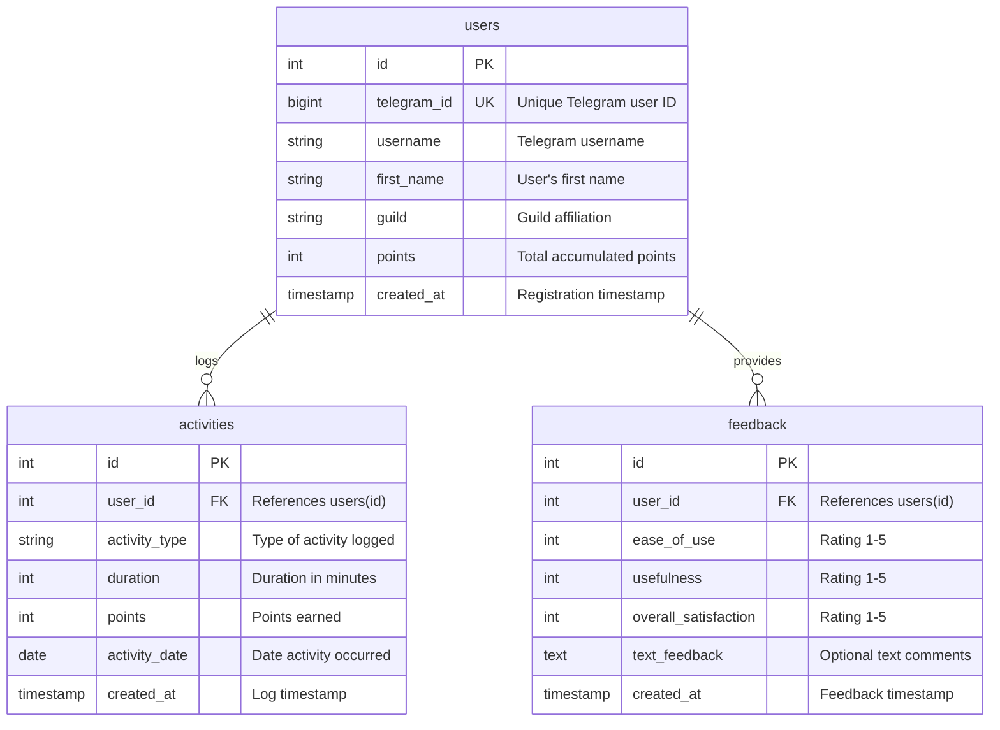

# Database Schema

PostgreSQL schema for the Activity Challenge Bot.

## Schema Overview

Three main tables with simple relationships:



## Tables

### users

```sql
CREATE TABLE users (
  id SERIAL PRIMARY KEY,
  telegram_id VARCHAR(50) UNIQUE NOT NULL,
  username VARCHAR(100),
  first_name VARCHAR(100),
  last_name VARCHAR(100),
  guild VARCHAR(100),
  points DECIMAL(10,2) DEFAULT 0 NOT NULL,
  created_at TIMESTAMP DEFAULT NOW() NOT NULL
);

CREATE INDEX idx_users_telegram_id ON users(telegram_id);
CREATE INDEX idx_users_guild ON users(guild) WHERE guild IS NOT NULL;
CREATE INDEX idx_users_points ON users(points DESC);
```

**Key Fields:**
- `telegram_id`: VARCHAR(50) handles large Telegram IDs safely
- `guild`: No foreign key - validated in application layer (see [Guild Management](/admin/guild-management.md))
- `points`: DECIMAL(10,2) for precision (no float errors)

### activities

```sql
CREATE TABLE activities (
  id SERIAL PRIMARY KEY,
  user_id INTEGER REFERENCES users(id) ON DELETE CASCADE NOT NULL,
  activity_type VARCHAR(255) NOT NULL,
  duration INTEGER,
  points DECIMAL(10,2) NOT NULL,
  description TEXT,
  activity_date DATE DEFAULT CURRENT_DATE,
  created_at TIMESTAMP DEFAULT NOW() NOT NULL
);

CREATE INDEX idx_activities_user_id ON activities(user_id);
CREATE INDEX idx_activities_date ON activities(activity_date);
CREATE INDEX idx_activities_user_date ON activities(user_id, activity_date);

-- Prevent duplicate submissions
CREATE UNIQUE INDEX idx_unique_activity ON activities(
  user_id, activity_type, activity_date, duration, points
);
```

**Key Fields:**
- `activity_type`: Full hierarchy path string (e.g., "Sports > Basketball > Playing basketball, game > competitive")
  - See [Activity Hierarchy](/reference/activity-hierarchy.md) for structure details
- `activity_date`: When performed (separate from `created_at` for retroactive logging)
- `points`: Calculated using MET formula (see [Point System](/reference/point-system.md))
- `CASCADE DELETE`: Remove activities when user deleted

### feedback

```sql
CREATE TABLE feedback (
  id SERIAL PRIMARY KEY,
  user_id INTEGER REFERENCES users(id) ON DELETE CASCADE NOT NULL,
  ease_of_use INTEGER CHECK (ease_of_use >= 1 AND ease_of_use <= 5),
  usefulness INTEGER CHECK (usefulness >= 1 AND usefulness <= 5),
  overall_satisfaction INTEGER CHECK (overall_satisfaction >= 1 AND overall_satisfaction <= 5),
  text_feedback TEXT NOT NULL,
  created_at TIMESTAMP DEFAULT CURRENT_TIMESTAMP,
  reviewed BOOLEAN DEFAULT FALSE
);

CREATE INDEX idx_feedback_user_id ON feedback(user_id);
CREATE INDEX idx_feedback_reviewed ON feedback(reviewed);
```

## Further Reading

- [Competition Setup](/admin/competition-setup.md) - Configure competition periods
- [Guild Management](/admin/guild-management.md) - Manage guild configuration
- [Activity Hierarchy](/reference/activity-hierarchy.md) - Activity structure
- [Point System](/reference/point-system.md) - Point calculation
- [PostgreSQL Documentation](https://www.postgresql.org/docs/current/) - Official docs