# Bot Flows & Wizards

How the bot organizes multi-step conversations using grammY's scene system.

> **Note**: This guide focuses on our specific implementations. For grammY/Telegraf scene basics, see [grammY Conversations](https://grammy.dev/plugins/conversations.html).

## Architecture Overview

The bot uses two main conversation patterns:

1. **Wizards**: Multi-step forms (activity logging, registration)
2. **Simple Scenes**: Single-step views (profile, stats, info)

All flows integrate with the [Two-Message Manager](/architecture/two-message-manager.md) pattern for clean UX.

## Wizard Pattern

Our wizards are implemented using `Scenes.WizardScene` with each step as a separate function.

### Activity Logging Wizard (7 Steps)

The most complex flow - users select from 1000+ activities through a hierarchical menu.

**State Structure:**
```typescript
interface WizardState {
  mainCategory?: string      // e.g., "Sports"
  subcategory?: string       // e.g., "Basketball"
  activity?: string          // e.g., "Playing basketball, game"
  intensity?: string         // e.g., "competitive"
  metValue?: number          // e.g., 8.0
  activityDate?: Date        // e.g., 2026-01-15
  duration?: number          // e.g., 45 minutes
  calculatedPoints?: number  // e.g., 6.0
}
```

**File Organization:**
```
flows/activity/
├── wizard.ts              # Wizard composition
├── steps/
│   ├── 1-category.ts      # Category selection
│   ├── 2-subcategory.ts   # Subcategory selection
│   ├── 3-activity.ts      # Activity selection
│   ├── 4-intensity.ts     # Intensity selection
│   ├── 5-date.ts          # Date picker
│   ├── 6-duration.ts      # Duration input
│   └── 7-confirm.ts       # Review & save
└── helpers/
    ├── activity-data.ts   # Hierarchy access
    └── navigation.ts      # Back/cancel handlers
```

See [Activity Hierarchy](/reference/activity-hierarchy.md) for details on the 1000+ activities and their MET values.

**Key Implementation Details:**

Each step file exports two functions:
```typescript
// Show the question
export async function showCategorySelection(ctx: any) {
  const categories = getMainCategories()
  const keyboard = buildKeyboard(categories)
  await TwoMessageManager.updateContent(ctx, 'Select category:', keyboard)
}

// Handle the response
export async function handleCategorySelection(ctx: any) {
  const category = extractCallbackData(ctx, 'category:')
  
  if (!isValidCategory(category)) {
    await ctx.answerCbQuery('❌ Invalid category')
    return false
  }
  
  ctx.wizard.state.mainCategory = category
  await ctx.answerCbQuery()
  return true
}
```

**Flow Diagram:**



```mermaid
flowchart TD
    A[User clicks 💪 Log Activity] --> B[Enter activity_wizard scene]
    B --> C[Step 0: Show categories]
    C --> D[User selects category]
    D --> E[Step 1: Show subcategories]
    E --> F[User selects subcategory]
    F --> G[Step 2: Show activities]
    G --> H[User selects activity]
    H --> I[Step 3: Show intensity levels]
    I --> J[User selects intensity]
    J --> K[Step 4: Show date picker]
    K --> L[User selects date]
    L --> M[Step 5: Ask for duration]
    M --> N[User enters minutes]
    N --> O[Calculate points:<br/>MET × minutes / 60]
    O --> P[Step 6: Show confirmation]
    P --> Q[User confirms]
    Q --> R[Save to database:<br/>- Insert into activities<br/>- Update users.points<br/>- Invalidate cache]
    R --> S[Show success message]
    S --> T[Return to main menu]

    %% Legend
    subgraph Legend
        L1[User Action]
        L2[Wizard Step]
        L3[Database/Calculation]
    end

    classDef userAction fill:#10b981,stroke:#059669,color:#fff
    classDef wizardStep fill:#6366f1,stroke:#4f46e5,color:#fff
    classDef dbAction fill:#f59e0b,stroke:#d97706,color:#fff
    
    class D,F,H,J,L,N,Q userAction
    class C,E,G,I,K,M,P wizardStep
    class O,R dbAction
    class L1 userAction
    class L2 wizardStep
    class L3 dbAction
```

**Point Calculation:**

See [Point System](/reference/point-system.md) for detailed explanation of the MET-based formula.

```typescript
// Step 6: Calculate points after duration input
ctx.wizard.state.calculatedPoints = (metValue * duration) / 60
```

**Database Save (Step 7):**
```typescript
// Insert activity
await createActivity({
  userId: user.id,
  activityType: `${mainCategory} > ${subcategory} > ${activity} > ${intensity}`,
  duration,
  points: calculatedPoints,
  activityDate,
  description: null
})

// Update user points
await addPointsToUser(user.id, calculatedPoints)

// Invalidate cache
invalidateGuildCache()
```

### Registration Wizard (3 Steps)

Simpler flow for new user onboarding.

**Flow Diagram:**



```mermaid
flowchart TD
    A[User clicks 📝 Register] --> B[Enter register_wizard scene]
    B --> C[Step 0: Show terms & conditions]
    C --> D[User accepts terms]
    D --> E[Step 1: Show guild selection]
    E --> F[User selects guild]
    F --> G[Step 2: Show confirmation]
    G --> H[User confirms]
    H --> I[Save to database:<br/>- Insert into users<br/>- Set points = 0]
    I --> J[Update reply keyboard<br/>add registered buttons]
    J --> K[Show success message]
    K --> L[Navigate to registered menu]

    %% Legend
    subgraph Legend
        L1[User Action]
        L2[Wizard Step]
        L3[Database Operation]
        L4[System Action]
    end

    classDef userAction fill:#10b981,stroke:#059669,color:#fff
    classDef wizardStep fill:#6366f1,stroke:#4f46e5,color:#fff
    classDef dbAction fill:#f59e0b,stroke:#d97706,color:#fff
    classDef systemAction fill:#8b5cf6,stroke:#7c3aed,color:#fff
    
    class D,F,H userAction
    class C,E,G wizardStep
    class I dbAction
    class J systemAction
    class L1 userAction
    class L2 wizardStep
    class L3 dbAction
    class L4 systemAction
```

**State:**
```typescript
interface PendingUser {
  telegramId: string
  username: string
  firstName: string
  lastName: string
  guild: string
}
```

**Key Features:**
- Terms must be accepted
- Guild validated against config (see [Guild Management](/admin/guild-management.md))
- Keyboard updated after registration (adds registered features)

## Simple Scenes

Single-step views that display information and provide navigation.

### Profile Scene Example

```typescript
const profileScene = new Scenes.BaseScene('profile')

profileScene.enter(async (ctx) => {
  const user = await getUserByTelegramId(ctx.from.id)
  const summary = await getUserSummary(ctx.from.id)
  
  const text = `👤 **Your Profile**\n\nName: ${user.first_name}\nPoints: ${user.points}\n\n🏆 Rankings:\nGlobal: #${summary.global_rank}\nGuild: #${summary.guild_rank}`
  
  await TwoMessageManager.updateContent(ctx, text, Markup.inlineKeyboard([
    [Markup.button.callback('📜 Activity History', 'profile:history')],
    [Markup.button.callback('🏠 Main Menu', 'nav:menu')]
  ]))
})

profileScene.action('profile:history', async (ctx) => {
  await ctx.scene.enter('activity_history')
})
```

See [Two-Message Manager](/architecture/two-message-manager.md) for details on the `updateContent` method.

## Navigation Patterns

### Escape Middleware

Allows users to exit wizards anytime:

```typescript
activityWizard.use(TwoMessageManager.createEscapeMiddleware())
```

Intercepts:
- `/start` command → Returns to main menu
- Reply keyboard buttons → Navigates to different scenes

See [Two-Message Manager](/architecture/two-message-manager.md) for implementation details.

### Back Buttons

```typescript
// In step handlers
if (ctx.callbackQuery?.data === 'back') {
  ctx.wizard.selectStep(previousStepIndex)
  await showPreviousStep(ctx)
  return
}
```

### Cancel Handlers

```typescript
export async function handleCancel(ctx: any) {
  await TwoMessageManager.deleteUserMessage(ctx)
  await ctx.scene.enter('registered_menu')
}
```

## State Management

**Wizard State**: Temporary, cleared when wizard exits
```typescript
activityWizard.leave(async (ctx) => {
  ctx.wizard.state = {}  // Clear on exit
})
```

**Session State**: Persists across scenes (see [Two-Message Manager](/architecture/two-message-manager.md))

**Database**: Permanent data only (see [Database Schema](/architecture/database.md))

## Scene Registration

```typescript
const stage = new Scenes.Stage([
  menuRouter,
  registeredMenu,
  unregisteredMenu,
  activityWizard,
  registerWizard,
  profileScene,
  statsScene,
  infoScene,
  feedbackWizard
])

bot.use(session())
bot.use(stage.middleware())
```

## Best Practices

✅ **Always validate user input** before advancing steps
✅ **Provide Cancel buttons** on every step
✅ **Use escape middleware** for all wizards
✅ **Clear state on leave** to prevent stale data
✅ **Answer callback queries** to remove loading indicators
✅ **Use descriptive callback data** (e.g., `category:Sports`)

❌ Don't skip input validation
❌ Don't forget to clean up wizard state
❌ Don't create wizards without escape routes

See [Code Patterns](/development/patterns.md) for more best practices.

## Testing Flows

Manual testing checklist:
- [ ] Complete happy path
- [ ] Cancel at each step
- [ ] Press /start mid-flow
- [ ] Send invalid input
- [ ] Rapid button clicking

See [Testing Guide](/development/testing.md) for automated testing strategies.

## Further Reading

- [Two-Message Manager Pattern](/architecture/two-message-manager.md) - Core UX pattern
- [Code Patterns](/development/patterns.md) - Implementation best practices
- [Activity Hierarchy](/reference/activity-hierarchy.md) - Activity database structure
- [Point System](/reference/point-system.md) - How points are calculated
- [grammY Scenes Documentation](https://grammy.dev/plugins/conversations.html) - Framework reference