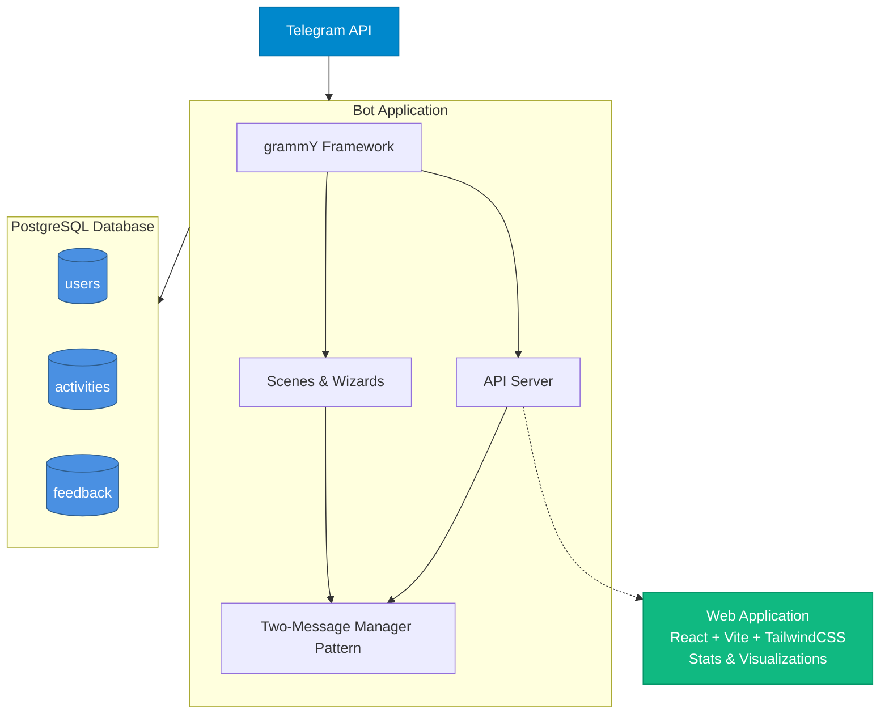

# Architecture Overview

A comprehensive guide to the Activity Challenge Bot's architecture, design patterns, and technical decisions.

## System Architecture



## Technology Stack

### Runtime & Language
- **Bun**: Fast JavaScript/TypeScript runtime with built-in bundler
- **TypeScript**: Type-safe development with full IDE support
- **Node.js Compatibility**: Can also run on Node.js if needed

### Bot Framework
- **grammY (Telegraf)**: Modern Telegram bot framework
  - Scene management for multi-step conversations
  - Wizard pattern for form-like flows
  - Middleware architecture
  - Inline keyboard support

### Database
- **PostgreSQL**: Robust relational database
- **postgres.js**: Lightweight PostgreSQL client for Bun/Node
- **SQL**: Direct SQL queries (no ORM) for performance and simplicity

### Frontend (Web App)
- **React 18**: UI framework
- **Vite**: Build tool and dev server
- **TailwindCSS**: Utility-first styling
- **Recharts**: Data visualization

### Infrastructure
- **Podman/Docker**: Container runtime
- **Kubernetes**: Production orchestration (Talos Linux)
- **Hetzner Cloud**: Hosting provider
- **Flux CD**: GitOps continuous deployment

## Core Design Patterns

### 1. Two-Message Manager Pattern

The bot maintains exactly two persistent messages per user:
1. **Content Message**: Displays current information (edited in place)
2. **Keyboard Message**: Shows reply keyboard at bottom (rarely changes)

**Benefits:**
- Clean, organized chat interface
- No message spam or clutter
- Consistent user experience
- Easy navigation without scrolling

**Implementation:** See [Two-Message Manager](./two-message-manager.md) for details.

### 2. Wizard Pattern (Multi-Step Flows)

Complex user interactions are implemented as wizards:
- Registration (3 steps)
- Activity logging (7 steps)
- Feedback collection (1 step with multi-part form)

Each wizard step:
1. Displays information/question
2. Waits for user input
3. Validates input
4. Stores in wizard state
5. Proceeds to next step

**State Management:**
```typescript
interface WizardState {
  mainCategory?: string
  subcategory?: string
  activity?: string
  intensity?: string
  metValue?: number
  activityDate?: Date
  duration?: number
  calculatedPoints?: number
}
```

### 3. Scene-Based Navigation

The bot uses scenes for different "screens":
- `menu_router`: Determines registered vs unregistered menu
- `registered_menu`: Main menu for registered users
- `unregistered_menu`: Menu for new users
- `activity_wizard`: Activity logging flow
- `register_wizard`: Registration flow
- `profile`: User profile view
- `stats_menu`: Statistics and leaderboards
- `info_menu`: Information and help
- `feedback_wizard`: Feedback collection

Scenes can be entered/exited, maintaining clean state transitions.

### 4. Inline Keyboard Navigation

All user interactions use inline keyboards (buttons within messages):
- No typing required for navigation
- Visual, tap-friendly interface
- Callback data for action handling
- Back/Cancel buttons on every step

**Example:**
```typescript
Markup.inlineKeyboard([
  [Markup.button.callback('Option 1', 'action:option1')],
  [Markup.button.callback('Option 2', 'action:option2')],
  [Markup.button.callback('❌ Cancel', 'action:cancel')]
])
```

### 5. Hierarchical Data Navigation

The 4-level activity hierarchy uses progressive disclosure:
- Start broad (category)
- Narrow down (subcategory)
- Get specific (activity)
- Choose intensity

Each level is paginated if needed, showing 8-12 items per page.

## Project Structure

```
src/
├── api/                    # REST API server (for web app)
│   └── server.ts
├── bot/                    # Telegram bot core
│   ├── commands.ts         # Command handlers (/start)
│   ├── handlers/           # Event handlers
│   ├── instance.ts         # Bot instance creation
│   ├── middleware.ts       # Session management
│   ├── setup.ts           # Bot configuration
│   └── start.ts           # Bot initialization
├── config/                 # Configuration files
│   ├── competition.ts      # Competition dates & settings
│   ├── contributors.ts     # Credits
│   ├── guilds.ts          # Guild definitions
│   └── index.ts
├── db/                    # Database layer
│   ├── activities.ts      # Activity CRUD operations
│   ├── connection.ts      # DB connection pool
│   ├── feedback.ts        # Feedback operations
│   ├── guilds.ts         # Guild operations
│   ├── migrate.ts        # Schema migrations
│   ├── points.ts         # Point calculations & rankings
│   ├── schema.sql        # Database schema
│   └── users.ts          # User CRUD operations
├── flows/                 # Scene implementations
│   ├── activity/         # Activity logging wizard
│   │   ├── helpers/      # Activity data & navigation
│   │   ├── steps/        # 7 wizard steps
│   │   └── wizard.ts     # Wizard composition
│   ├── feedback.ts       # Feedback collection
│   ├── info/             # Info screens
│   ├── menu/             # Menu routers
│   ├── profile/          # User profile views
│   ├── register/         # Registration wizard
│   │   ├── helpers/
│   │   ├── steps/        # 3 wizard steps
│   │   └── wizard.ts
│   └── stats/            # Statistics & leaderboards
├── types/                # TypeScript type definitions
│   └── index.ts
└── utils/                # Utility functions
    ├── calendar.ts       # Date picker
    ├── format-list.ts    # List formatting
    ├── texts.ts         # Text utilities
    ├── two-message-manager.ts  # Core pattern
    └── webapp-auth.ts   # Web app authentication
```

## Data Flow

### Activity Logging Flow

```
1. User clicks "💪 Log Activity"
   ↓
2. Bot enters activity_wizard scene
   ↓
3. Wizard Step 0: Show categories
   ↓
4. User selects category
   ↓
5. Wizard Step 1: Show subcategories
   ↓
6. User selects subcategory
   ↓
7. Wizard Step 2: Show activities
   ↓
8. User selects activity
   ↓
9. Wizard Step 3: Show intensity levels
   ↓
10. User selects intensity
    ↓
11. Wizard Step 4: Show date picker
    ↓
12. User selects date
    ↓
13. Wizard Step 5: Ask for duration
    ↓
14. User enters minutes
    ↓
15. Calculate points: (MET × minutes) / 60
    ↓
16. Wizard Step 6: Show confirmation
    ↓
17. User confirms
    ↓
18. Save to database:
    - Insert into activities table
    - Update users.points
    - Invalidate guild leaderboard cache
    ↓
19. Show success message
    ↓
20. Return to main menu
```

### Registration Flow

```
1. User clicks "📝 Register"
   ↓
2. Bot enters register_wizard scene
   ↓
3. Wizard Step 0: Show terms & conditions
   ↓
4. User accepts terms
   ↓
5. Wizard Step 1: Show guild selection
   ↓
6. User selects guild
   ↓
7. Wizard Step 2: Show confirmation
   ↓
8. User confirms
   ↓
9. Save to database:
    - Insert into users table
    - Set points = 0
    ↓
10. Update reply keyboard (add registered buttons)
    ↓
11. Show success message
    ↓
12. Navigate to registered menu
```

## Database Design

### Schema Overview

Three main tables with simple relationships:

```sql
users (id, telegram_id, username, first_name, guild, points, created_at)
  ↓ (one-to-many)
activities (id, user_id, activity_type, duration, points, activity_date, created_at)

feedback (id, user_id, ease_of_use, usefulness, overall_satisfaction, text_feedback, created_at)
```

### Key Design Decisions

1. **Denormalized Points**: Points stored in both `users.points` (aggregate) and `activities.points` (individual)
   - Enables fast ranking queries
   - Maintains detailed history
   - Easy to verify consistency

2. **String-Based Activity Types**: Full hierarchy path stored as string
   - Flexible (no schema changes needed)
   - Human-readable
   - Simple queries

3. **No Foreign Key for Guilds**: Guild names validated at application layer
   - Allows adding guilds without migrations
   - Simpler deployment

4. **Separate Date Fields**: `activity_date` (when activity happened) vs `created_at` (when logged)
   - Supports retroactive logging
   - Useful for analytics

See [Database Schema](./database.md) for complete details.

## Session Management

Bot sessions store:
- User registration status
- Current scene/wizard state
- Two persistent message IDs
- Last displayed scene and content (for deduplication)

```typescript
interface Session {
  contentMessageId?: number
  keyboardMessageId?: number
  lastSceneId?: string
  lastContent?: string
  // Wizard state stored in ctx.wizard.state
}
```

Sessions are stored in-memory (not persisted between bot restarts).

## Error Handling

### Telegram API Errors

```typescript
try {
  await ctx.telegram.editMessageText(...)
} catch (error) {
  // If edit fails (message too old), create new message
  const newMsg = await ctx.reply(...)
  ctx.session.contentMessageId = newMsg.message_id
}
```

### Database Errors

```typescript
try {
  await sql`INSERT INTO activities ...`
} catch (error) {
  await ctx.reply('❌ Failed to save activity. Please try again.')
  console.error('Database error:', error)
}
```

### User Input Validation

All user inputs validated before database operations:
- Date within competition period
- Duration > 0 and < reasonable maximum
- Guild exists in configuration
- Activity hierarchy path valid

## Performance Optimizations

### Guild Leaderboard Caching

```typescript
// 5-minute in-memory cache
let guildStatsCache: GuildStatsCache[] = []
let lastCacheUpdate: Date | null = null
const CACHE_TTL_MS = 5 * 60 * 1000

// Invalidate on activity submission
export function invalidateGuildCache(): void {
  lastCacheUpdate = null
}
```

### Database Indexing

Strategic indexes for common queries:
- `users(telegram_id)` - User lookup
- `users(points DESC)` - Rankings
- `activities(user_id, activity_date)` - User history
- `activities(created_at DESC)` - Recent activities

### Window Functions for Rankings

```sql
-- Efficient ranking without subqueries
SELECT 
  *,
  RANK() OVER (ORDER BY points DESC) as rank
FROM users
```

## Security Considerations

### Input Sanitization

- All callback data validated before processing
- SQL injection prevented (parameterized queries)
- User messages deleted after processing (clean chat)

### Data Privacy

- Only Telegram ID, name, and guild stored
- No location tracking
- No sensitive health data
- Users can request data deletion

### Authentication

Web app uses Telegram Web App authentication:
- Validates init data signature
- Verifies user identity through Telegram
- No separate login system needed

## Deployment Architecture

### Development
- Local Docker Compose setup
- PostgreSQL container
- Bot container with hot reload

### Production
- Kubernetes cluster (Talos Linux)
- PostgreSQL StatefulSet with persistent storage
- Bot Deployment with rolling updates
- Web app served via static hosting
- Flux CD for GitOps

See deployment documentation (maintained by your friend) for details.

## Monitoring & Logging

Currently implemented:
- Console logging for errors
- Database connection health checks
- Cache statistics endpoint

Future considerations:
- Prometheus metrics
- Grafana dashboards
- Error tracking (Sentry)
- Usage analytics

## Testing Strategy

The project includes tests for:
- Point calculations
- Ranking algorithms
- Leaderboard logic

```bash
bun test              # Run all tests
bun test:watch        # Watch mode
bun test:coverage     # Coverage report
```

Tests use Bun's built-in test runner (similar to Jest).

## Configuration Management

### Environment Variables

```bash
BOT_TOKEN=          # Telegram bot token
DATABASE_URL=       # PostgreSQL connection string
NODE_ENV=           # production/development
PORT=               # API server port (default 3000)
```

### Application Configuration

Competition dates and guild settings in code:
- `src/config/competition.ts` - Competition period
- `src/config/guilds.ts` - Guild definitions

This allows version control and type safety for critical configuration.

## Future Architecture Considerations

Potential improvements:
1. **Redis for Sessions**: Persist sessions across bot restarts
2. **Message Queue**: Handle high-volume activity logging
3. **Microservices**: Separate API server for web app
4. **GraphQL API**: More flexible data querying for web app
5. **Webhook Mode**: More reliable than long polling
6. **Rate Limiting**: Prevent abuse (currently unlimited)

These would be needed if scaling beyond a single university community.