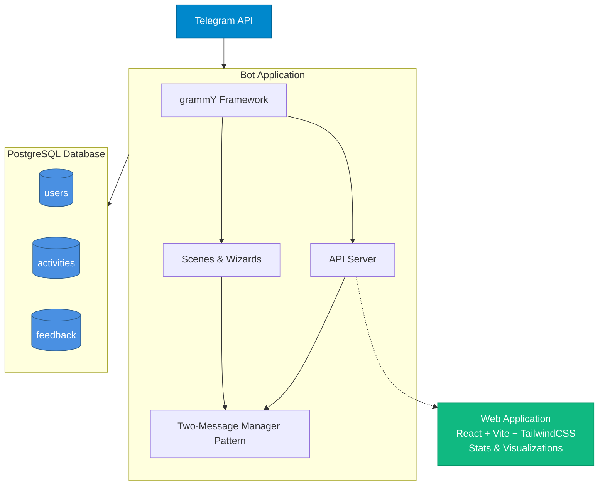

# Architecture Overview

A comprehensive guide to the Activity Challenge Bot's architecture, design patterns, and technical decisions.

## System Architecture



## Technology Stack

### Runtime & Language
- **Bun**: Fast JavaScript/TypeScript runtime with built-in bundler
- **TypeScript**: Type-safe development with full IDE support
- **Node.js Compatibility**: Can also run on Node.js if needed

### Bot Framework
- **grammY (Telegraf)**: Modern Telegram bot framework
  - Scene management for multi-step conversations
  - Wizard pattern for form-like flows
  - Middleware architecture
  - Inline keyboard support

### Database
- **PostgreSQL**: Robust relational database
- **postgres.js**: Lightweight PostgreSQL client for Bun/Node
- **SQL**: Direct SQL queries (no ORM) for performance and simplicity

See [Database Architecture](./database.md) for schema details.

### Frontend (Web App)
- **React 18**: UI framework
- **Vite**: Build tool and dev server
- **TailwindCSS**: Utility-first styling
- **Recharts**: Data visualization

### Infrastructure
- **Podman/Docker**: Container runtime
- **Kubernetes**: Production orchestration (Talos Linux)
- **Hetzner Cloud**: Hosting provider
- **Flux CD**: GitOps continuous deployment

## Core Design Patterns

### 1. Two-Message Manager Pattern

The bot maintains exactly two persistent messages per user: a content message (edited in place) and a keyboard message (stays at bottom).

**Benefits:**
- Clean, organized chat interface
- No message spam or clutter
- Consistent user experience
- Easy navigation without scrolling

See [Two-Message Manager](./two-message-manager.md) for complete implementation details.

### 2. Wizard Pattern (Multi-Step Flows)

Complex user interactions use wizards:
- Registration (3 steps)
- Activity logging (7 steps)
- Feedback collection (1 step with multi-part form)

Each wizard step displays information, waits for input, validates, stores state, and proceeds to next step.

See [Flows and Wizards](./flows-and-wizards.md) for detailed flow diagrams and implementation.

### 3. Scene-Based Navigation

The bot uses scenes for different "screens":
- `menu_router`: Determines registered vs unregistered menu
- `registered_menu`: Main menu for registered users
- `unregistered_menu`: Menu for new users
- `activity_wizard`: Activity logging flow
- `register_wizard`: Registration flow
- `profile`: User profile view
- `stats_menu`: Statistics and leaderboards
- `info_menu`: Information and help
- `feedback_wizard`: Feedback collection

### 4. Inline Keyboard Navigation

All user interactions use inline keyboards (buttons within messages):
- No typing required for navigation
- Visual, tap-friendly interface
- Callback data for action handling
- Back/Cancel buttons on every step

### 5. Hierarchical Data Navigation

The 4-level activity hierarchy uses progressive disclosure (Category → Subcategory → Activity → Intensity). Each level is paginated if needed, showing 8-12 items per page.

See [Activity Hierarchy](/reference/activity-hierarchy.md) for complete structure.

## Project Structure

```
src/
├── api/                    # REST API server (for web app)
├── bot/                    # Telegram bot core
├── config/                 # Configuration files
├── db/                     # Database layer
├── flows/                  # Scene implementations
├── types/                  # TypeScript type definitions
└── utils/                  # Utility functions
```

See [Project Structure](/development/project-structure.md) for detailed breakdown.

## Data Flow

The bot uses multi-step wizards for complex operations like activity logging and registration.

See [Flows and Wizards](./flows-and-wizards.md) for detailed flow diagrams showing:
- Activity Logging Flow (7 steps)
- Registration Flow (3 steps)

## Database Design

Three main tables with simple relationships:
- **users**: Participant information and total points
- **activities**: Logged activities with individual points
- **feedback**: User feedback submissions

**Key Design Decisions:**
1. **Denormalized Points**: Stored in both `users.points` (fast rankings) and `activities.points` (detailed history)
2. **String-Based Activity Types**: Full hierarchy path as string for flexibility
3. **No Foreign Key for Guilds**: Validated at application layer for easy guild management
4. **Separate Date Fields**: `activity_date` (when activity happened) vs `created_at` (when logged)

See [Database Schema](./database.md) for complete ERD and schema details.

## Session Management

Bot sessions store:
- User registration status
- Current scene/wizard state
- Two persistent message IDs
- Last displayed scene and content (for deduplication)

Sessions are stored in-memory (not persisted between bot restarts).

## Error Handling

### Telegram API Errors
```typescript
try {
  await ctx.telegram.editMessageText(...)
} catch (error) {
  // If edit fails, create new message
  const newMsg = await ctx.reply(...)
  ctx.session.contentMessageId = newMsg.message_id
}
```

### Database Errors
All database operations wrapped in try-catch with user-friendly error messages.

### User Input Validation
All inputs validated before database operations:
- Date within competition period (see [Competition Setup](/admin/competition-setup.md))
- Duration > 0 and reasonable
- Guild exists in configuration (see [Guild Management](/admin/guild-management.md))
- Activity hierarchy path valid

## Performance Optimizations

### Guild Leaderboard Caching
5-minute in-memory cache, invalidated on activity submission.

### Database Indexing
Strategic indexes for common queries: user lookup, rankings, user history, recent activities.

See [Database Schema](./database.md) for index details.

### Window Functions for Rankings
```sql
-- Efficient ranking without subqueries
SELECT *, RANK() OVER (ORDER BY points DESC) as rank
FROM users
```

## Security Considerations

### Input Sanitization
- All callback data validated before processing
- SQL injection prevented (parameterized queries)
- User messages deleted after processing (clean chat)

### Data Privacy
- Only Telegram ID, name, and guild stored
- No location tracking or sensitive health data
- Users can request data deletion

See [Database Operations](/admin/database-operations.md) for security best practices.

### Authentication
Web app uses Telegram Web App authentication - validates init data signature through Telegram.

## Deployment Architecture

### Development
- Local Docker Compose setup
- PostgreSQL container
- Bot container with hot reload

See [Local Development](/guide/local-development.md) for setup.

### Production
- Kubernetes cluster (Talos Linux)
- PostgreSQL StatefulSet with persistent storage
- Bot Deployment with rolling updates
- Web app served via static hosting
- Flux CD for GitOps

See [Kubernetes Dev Guide](/guide/kubernetes-dev.md) for cluster setup.

## Configuration Management

### Environment Variables
See [Environment Setup](/guide/environment-setup.md) for complete configuration reference.

### Application Configuration
- **Competition dates**: See [Competition Setup](/admin/competition-setup.md)
- **Guild settings**: See [Guild Management](/admin/guild-management.md)

Configuration in code allows version control and type safety.

## Monitoring & Logging

Currently implemented:
- Console logging for errors
- Database connection health checks
- Cache statistics endpoint

See [Monitoring](/admin/monitoring.md) for operations guide.

## Testing Strategy

Tests for point calculations, ranking algorithms, and leaderboard logic using Bun's test runner.

See [Testing Guide](/development/testing.md) for patterns and examples.

## Further Reading

### Architecture Deep Dives
- [Database Schema](./database.md) - Complete schema and design decisions
- [Flows and Wizards](./flows-and-wizards.md) - Conversation flow implementation
- [Two-Message Manager](./two-message-manager.md) - Core UX pattern

### Administration
- [Competition Setup](/admin/competition-setup.md) - Configure competition periods
- [Guild Management](/admin/guild-management.md) - Manage guilds
- [Database Operations](/admin/database-operations.md) - Backup and maintenance
- [Monitoring](/admin/monitoring.md) - Health checks and troubleshooting

### Development
- [Getting Started](/guide/getting-started.md) - Setup and first run
- [Local Development](/guide/local-development.md) - Development workflow
- [Project Structure](/development/project-structure.md) - Code organization
- [Code Patterns](/development/patterns.md) - Best practices
- [Testing](/development/testing.md) - Testing guide

### Reference
- [Point System](/reference/point-system.md) - How points are calculated
- [Activity Hierarchy](/reference/activity-hierarchy.md) - Complete activity database